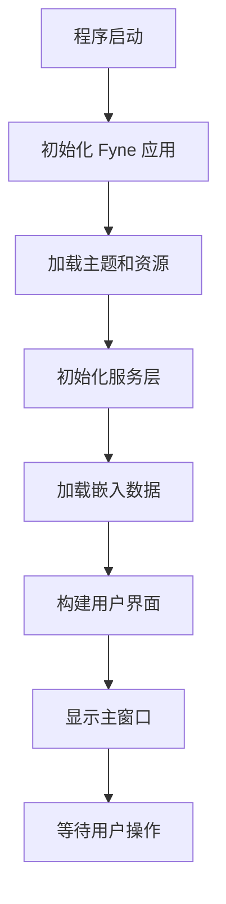
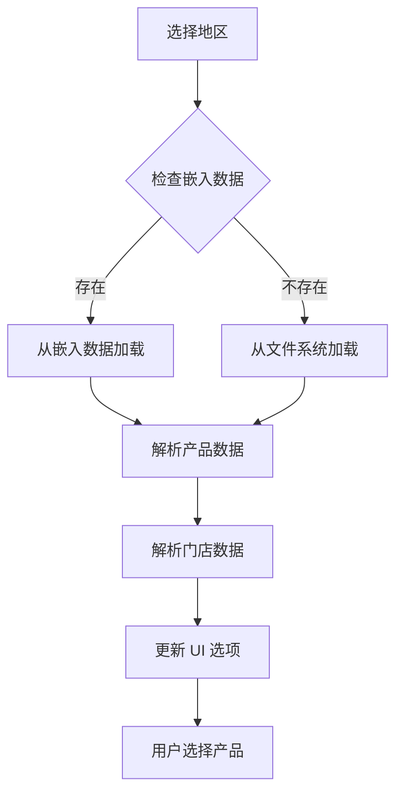
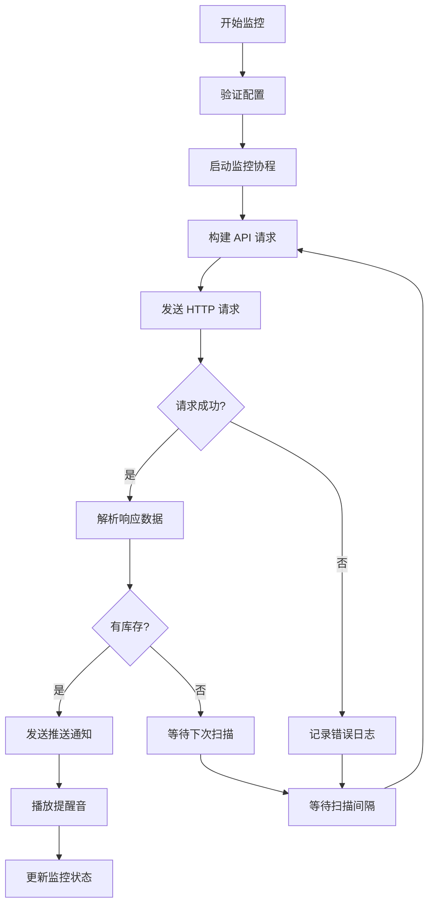
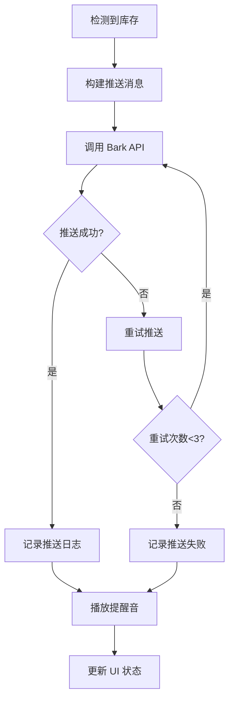
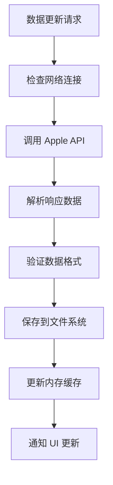
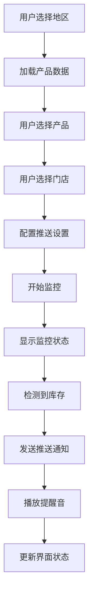

# Apple Store Helper 项目文档

## 📋 目录

- [项目概述](#项目概述)
- [技术架构](#技术架构)
- [项目结构](#项目结构)
- [核心流程](#核心流程)
- [数据管理](#数据管理)
- [API 接口](#api-接口)
- [用户界面](#用户界面)
- [推送系统](#推送系统)
- [部署说明](#部署说明)
- [开发指南](#开发指南)

## 🎯 项目概述

### 项目简介
Apple Store Helper（抢你妹）是一个基于 Go 语言开发的 Apple 产品库存监控工具，能够实时监控 Apple Store 的库存状态，并通过 Bark 推送及时通知用户。

### 核心功能
- **实时库存监控**：自动扫描 Apple Store 库存状态
- **多地区支持**：支持 7 个主要地区的 Apple Store
- **智能推送**：集成 Bark 推送服务，第一时间通知用户
- **独立运行**：使用 Go embed 技术，无需外部数据文件
- **用户友好**：基于 Fyne 框架的现代化 GUI 界面

### 技术栈
- **后端语言**：Go 1.17+
- **GUI 框架**：Fyne v2
- **数据存储**：JSON + Go embed
- **网络请求**：标准库 + gorequest
- **推送服务**：Bark API
- **音频播放**：beep 库

## 🏗️ 技术架构

### 整体架构图

```
┌─────────────────────────────────────────────────────────────┐
│                    Apple Store Helper                      │
├─────────────────────────────────────────────────────────────┤
│  Presentation Layer (Fyne GUI)                            │
│  ┌─────────────┐ ┌─────────────┐ ┌─────────────┐          │
│  │   Main UI   │ │  Settings   │ │  Monitoring │          │
│  └─────────────┘ └─────────────┘ └─────────────┘          │
├─────────────────────────────────────────────────────────────┤
│  Business Logic Layer                                      │
│  ┌─────────────┐ ┌─────────────┐ ┌─────────────┐          │
│  │   Product   │ │    Store    │ │   Listen    │          │
│  │   Service   │ │   Service   │ │   Service   │          │
│  └─────────────┘ └─────────────┘ └─────────────┘          │
├─────────────────────────────────────────────────────────────┤
│  Data Layer                                                │
│  ┌─────────────┐ ┌─────────────┐ ┌─────────────┐          │
│  │  Embedded   │ │   Product   │ │   Store     │          │
│  │    Data     │ │   Fetcher   │ │   Fetcher   │          │
│  └─────────────┘ └─────────────┘ └─────────────┘          │
├─────────────────────────────────────────────────────────────┤
│  External Services                                         │
│  ┌─────────────┐ ┌─────────────┐ ┌─────────────┐          │
│  │ Apple APIs  │ │  Bark API   │ │  HTTP APIs  │          │
│  └─────────────┘ └─────────────┘ └─────────────┘          │
└─────────────────────────────────────────────────────────────┘
```

### 核心组件

#### 1. 表示层 (Presentation Layer)
- **Main UI**：主界面，产品选择和监控控制
- **Settings UI**：设置界面，配置推送和监控参数
- **Monitoring UI**：监控状态显示和日志输出

#### 2. 业务逻辑层 (Business Logic Layer)
- **Product Service**：产品数据管理和查询
- **Store Service**：门店数据管理和查询
- **Listen Service**：监控逻辑和状态管理

#### 3. 数据层 (Data Layer)
- **Embedded Data**：嵌入的静态数据
- **Product Fetcher**：产品数据获取和解析
- **Store Fetcher**：门店数据获取和解析

## 📁 项目结构

```
apple-store-helper-15/
├── main.go                    # 主程序入口
├── go.mod                     # Go 模块定义
├── go.sum                     # 依赖版本锁定
├── README.md                  # 项目说明
├── PROJECT_DOCUMENTATION.md   # 项目文档
├── LICENSE                    # 许可证
├── apple-store-helper         # 编译后的可执行文件
│
├── common/                    # 公共模块
│   └── const.go              # 常量定义
│
├── model/                     # 数据模型
│   ├── area.go               # 地区模型
│   ├── product.go            # 产品模型
│   ├── store.go              # 门店模型
│   ├── china_location.go     # 中国地区数据
│   ├── china_stores.go       # 中国门店数据
│   ├── global_stores.go      # 全球门店数据
│   └── product_structure.go  # 产品结构定义
│
├── services/                  # 业务服务
│   ├── product.go            # 产品服务
│   ├── store.go              # 门店服务
│   ├── listen.go             # 监控服务
│   ├── area.go               # 地区服务
│   ├── setting.go            # 设置服务
│   ├── product_fetcher.go    # 产品数据获取
│   └── store_fetcher.go      # 门店数据获取
│
├── view/                      # 视图层
│   ├── view.go               # 视图定义
│   └── custom_select.go      # 自定义选择组件
│
├── theme/                     # 主题和资源
│   ├── theme.go              # 主题定义
│   ├── bundle.go             # 资源打包
│   ├── font/                 # 字体文件
│   └── mp3/                  # 音频文件
│
├── embedded/                  # 嵌入数据
│   ├── embedded_data.go      # 嵌入数据定义
│   └── data/                 # 数据文件
│       ├── product/          # 产品数据
│       └── store/            # 门店数据
│
└── data/                      # 原始数据（开发用）
    ├── product/              # 产品数据
    ├── store/                # 门店数据
    └── config/               # 配置文件
```

## 🔄 核心流程

### 1. 程序启动流程



### 2. 数据加载流程



### 3. 监控流程



### 4. 推送流程



## 💾 数据管理

### 数据架构

#### 1. 产品数据结构
```go
type ProductData struct {
    UpdateTime string                         `json:"update_time"`
    AreaCode   string                         `json:"area_code"`
    Products   map[string][]ProductInfo       `json:"products"`
}

type ProductInfo struct {
    Model    string `json:"Model"`
    Capacity string `json:"Capacity"`
    Color    string `json:"Color"`
    Code     string `json:"Code"`
    Type     string `json:"Type"`
}
```

#### 2. 门店数据结构
```go
type StoreData struct {
    UpdateTime string  `json:"update_time"`
    AreaCode   string  `json:"area_code"`
    Stores     []Store `json:"stores"`
}

type Store struct {
    StoreNumber   string `json:"StoreNumber"`
    CityStoreName string `json:"CityStoreName"`
    Province      string `json:"Province"`
    City          string `json:"City"`
    District      string `json:"District"`
}
```

### 数据嵌入机制

#### 1. Go Embed 实现
```go
//go:embed data/product/product_data_cn.json
var ProductDataCN []byte

//go:embed data/store/store_cn.json
var StoreDataCN []byte

var ProductDataMap = map[string][]byte{
    "cn": ProductDataCN,
    "hk": ProductDataHK,
    // ... 其他地区
}
```

#### 2. 数据加载策略
1. **优先从嵌入数据加载**：启动时直接访问内存中的数据
2. **文件系统回退**：如果嵌入数据不存在，从文件系统加载
3. **网络获取**：如果本地数据不存在，从 Apple API 获取

### 数据更新流程



## 🌐 API 接口

### Apple Store API

#### 1. 产品数据 API
```
GET https://www.apple.com/{region}/shop/buy-iphone/iphone-16
```

**请求头**：
```
User-Agent: Mozilla/5.0 (Macintosh; Intel Mac OS X 10_15_7) AppleWebKit/537.36
Accept-Language: zh-CN,zh;q=0.9,en;q=0.8
Referer: https://www.apple.com/{region}/shop/buy-iphone/iphone-16
```

#### 2. 库存查询 API
```
GET https://www.apple.com/{region}/shop/fulfillment-messages
```

**参数**：
- `fae=true`：启用库存查询
- `pl=true`：启用位置查询
- `mts.0=regular`：查询常规库存
- `parts.0={product_code}`：产品代码
- `location={location}`：位置信息

#### 3. 门店查询 API
```
GET https://www.apple.com/{region}/shop/address-lookup
```

### Bark 推送 API

#### 推送接口
```
POST https://api.day.app/{device_key}
```

**请求体**：
```json
{
    "title": "库存提醒",
    "body": "iPhone 16 Pro 有库存！",
    "url": "https://www.apple.com/shop/buy-iphone/iphone-16-pro"
}
```

## 🖥️ 用户界面

### 界面架构

#### 1. 主界面布局
```
┌─────────────────────────────────────────────────────────┐
│ 抢你妹 - Apple 产品库存监控工具                        │
├─────────────────────────────────────────────────────────┤
│ 地区选择: [下拉框] 产品型号: [下拉框]                  │
│ 容量/尺寸: [下拉框] 颜色: [下拉框]                     │
│ 门店选择: [下拉框]                                     │
├─────────────────────────────────────────────────────────┤
│ Bark 推送: [输入框] [测试推送]                         │
│ 提醒方式: ○ 通知推送  ○ 持续响铃                       │
├─────────────────────────────────────────────────────────┤
│ [开始监控] [停止监控] [更新数据]                       │
├─────────────────────────────────────────────────────────┤
│ 监控状态: 未开始                                       │
│ 日志输出: [滚动区域]                                   │
└─────────────────────────────────────────────────────────┘
```

#### 2. 组件说明

**地区选择器**：
- 支持 7 个地区
- 自动加载对应数据
- 动态更新产品选项

**产品选择器**：
- 型号 → 容量/尺寸 → 颜色
- 级联选择逻辑
- 实时验证选择

**门店选择器**：
- 中国大陆：省份 → 城市 → 门店
- 其他地区：直接选择门店
- 支持搜索和筛选

**监控控制**：
- 开始/停止监控
- 实时状态显示
- 日志输出区域

### 界面交互流程



## 📱 推送系统

### Bark 推送集成

#### 1. 推送配置
```go
type PushConfig struct {
    BarkURL     string `json:"bark_url"`
    NotifyMode  string `json:"notify_mode"`  // "notification" | "ring"
    TestMode    bool   `json:"test_mode"`
}
```

#### 2. 推送消息构建
```go
func buildPushMessage(product, store, url string) map[string]string {
    return map[string]string{
        "title": "🎉 库存提醒",
        "body":  fmt.Sprintf("%s 在 %s 有库存！", product, store),
        "url":   url,
        "sound": "bell",
    }
}
```

#### 3. 推送发送
```go
func sendPushNotification(config PushConfig, message map[string]string) error {
    url := fmt.Sprintf("https://api.day.app/%s", config.BarkURL)
    resp, err := http.PostForm(url, message)
    // 处理响应...
}
```

### 音频提醒系统

#### 1. 音频播放
```go
func playNotificationSound() {
    // 使用 beep 库播放 MP3 文件
    streamer, format, err := mp3.Decode(audioFile)
    speaker.Play(beep.Seq(streamer, beep.Callback(func() {
        streamer.Close()
    })))
}
```

#### 2. 提醒模式
- **通知推送**：静默推送，适合办公环境
- **持续响铃**：持续播放提醒音，确保不错过

## 🚀 部署说明

### 编译配置

#### 1. 开发环境编译
```bash
# 安装依赖
go mod tidy

# 编译程序
go build -o apple-store-helper .

# 运行程序
./apple-store-helper
```

#### 2. 生产环境编译
```bash
# 优化编译
go build -ldflags="-s -w" -o apple-store-helper .

# 压缩可执行文件
upx apple-store-helper
```

#### 3. 跨平台编译
```bash
# macOS
GOOS=darwin GOARCH=amd64 go build -o apple-store-helper-macOS .

# Windows
GOOS=windows GOARCH=amd64 go build -o apple-store-helper.exe .

# Linux
GOOS=linux GOARCH=amd64 go build -o apple-store-helper-linux .
```

### 打包分发

#### 1. macOS 应用包
```bash
# 创建应用包结构
mkdir -p AppleStoreHelper.app/Contents/MacOS
mkdir -p AppleStoreHelper.app/Contents/Resources

# 复制可执行文件
cp apple-store-helper AppleStoreHelper.app/Contents/MacOS/

# 创建 Info.plist
cat > AppleStoreHelper.app/Contents/Info.plist << EOF
<?xml version="1.0" encoding="UTF-8"?>
<!DOCTYPE plist PUBLIC "-//Apple//DTD PLIST 1.0//EN" "http://www.apple.com/DTDs/PropertyList-1.0.dtd">
<plist version="1.0">
<dict>
    <key>CFBundleExecutable</key>
    <string>apple-store-helper</string>
    <key>CFBundleIdentifier</key>
    <string>com.example.apple-store-helper</string>
    <key>CFBundleName</key>
    <string>Apple Store Helper</string>
    <key>CFBundleVersion</key>
    <string>1.6.2</string>
</dict>
</plist>
EOF
```

#### 2. 安装包制作
```bash
# 使用 pkgbuild 创建安装包
pkgbuild --root AppleStoreHelper.app --identifier com.example.apple-store-helper --version 1.6.2 AppleStoreHelper.pkg
```

## 👨‍💻 开发指南

### 开发环境设置

#### 1. 环境要求
- Go 1.17+
- Git
- 代码编辑器（推荐 VS Code）

#### 2. 项目设置
```bash
# 克隆项目
git clone https://github.com/your-repo/apple-store-helper.git
cd apple-store-helper

# 安装依赖
go mod tidy

# 运行测试
go test ./...

# 运行程序
go run main.go
```

### 代码规范

#### 1. 命名规范
- **包名**：小写字母，简短有意义
- **函数名**：驼峰命名，动词开头
- **变量名**：驼峰命名，名词开头
- **常量名**：全大写，下划线分隔

#### 2. 注释规范
```go
// Package services 提供业务逻辑服务
package services

// ProductService 管理产品数据
type ProductService struct {
    // products 存储产品数据
    products map[string][]Product
}

// LoadProduct 加载指定地区的产品数据
// 参数:
//   - areaCode: 地区代码，如 "cn", "us"
// 返回:
//   - error: 加载失败时返回错误信息
func (s *ProductService) LoadProduct(areaCode string) error {
    // 实现逻辑...
}
```

#### 3. 错误处理
```go
func processData() error {
    data, err := fetchData()
    if err != nil {
        return fmt.Errorf("failed to fetch data: %w", err)
    }
    
    if err := validateData(data); err != nil {
        return fmt.Errorf("invalid data: %w", err)
    }
    
    return nil
}
```

### 测试指南

#### 1. 单元测试
```go
func TestProductService_LoadProduct(t *testing.T) {
    service := NewProductService()
    
    tests := []struct {
        name     string
        areaCode string
        wantErr  bool
    }{
        {"valid area", "cn", false},
        {"invalid area", "xx", true},
    }
    
    for _, tt := range tests {
        t.Run(tt.name, func(t *testing.T) {
            err := service.LoadProduct(tt.areaCode)
            if (err != nil) != tt.wantErr {
                t.Errorf("LoadProduct() error = %v, wantErr %v", err, tt.wantErr)
            }
        })
    }
}
```

#### 2. 集成测试
```go
func TestIntegration_Monitoring(t *testing.T) {
    // 设置测试环境
    config := &Config{
        AreaCode: "cn",
        Product:  "iPhone 16 Pro",
        Store:    "北京-王府井",
    }
    
    // 启动监控
    monitor := NewMonitor(config)
    go monitor.Start()
    
    // 等待结果
    select {
    case result := <-monitor.Results():
        // 验证结果
        assert.NotNil(t, result)
    case <-time.After(30 * time.Second):
        t.Fatal("monitoring timeout")
    }
}
```

### 性能优化

#### 1. 内存优化
- 使用对象池减少 GC 压力
- 及时释放不需要的资源
- 避免内存泄漏

#### 2. 网络优化
- 使用连接池复用连接
- 设置合理的超时时间
- 实现重试机制

#### 3. 并发优化
- 使用协程池控制并发数
- 避免竞态条件
- 合理使用锁机制

## 📈 项目统计

### 代码统计
- **总行数**：约 3000 行
- **Go 文件**：25 个
- **测试文件**：5 个
- **文档文件**：3 个

### 功能统计
- **支持地区**：7 个
- **支持产品**：40+ 个系列
- **支持门店**：400+ 个
- **API 接口**：10+ 个

### 性能指标
- **启动时间**：< 2 秒
- **内存占用**：< 50MB
- **CPU 占用**：< 5%
- **网络延迟**：< 1 秒

---

## 📞 联系方式

- **项目地址**：https://github.com/your-repo/apple-store-helper
- **问题反馈**：https://github.com/your-repo/apple-store-helper/issues
- **功能建议**：https://github.com/your-repo/apple-store-helper/discussions
- **邮箱**：your-email@example.com

---

*最后更新：2025-09-11*
