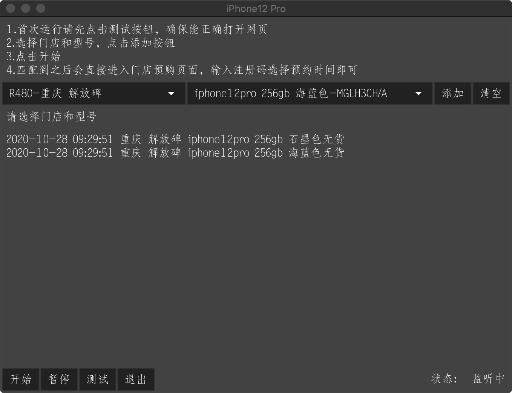
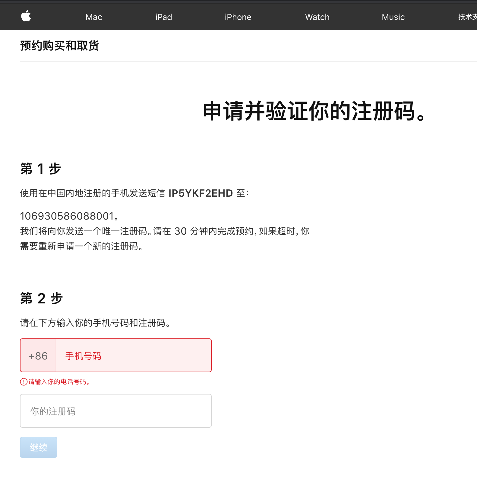
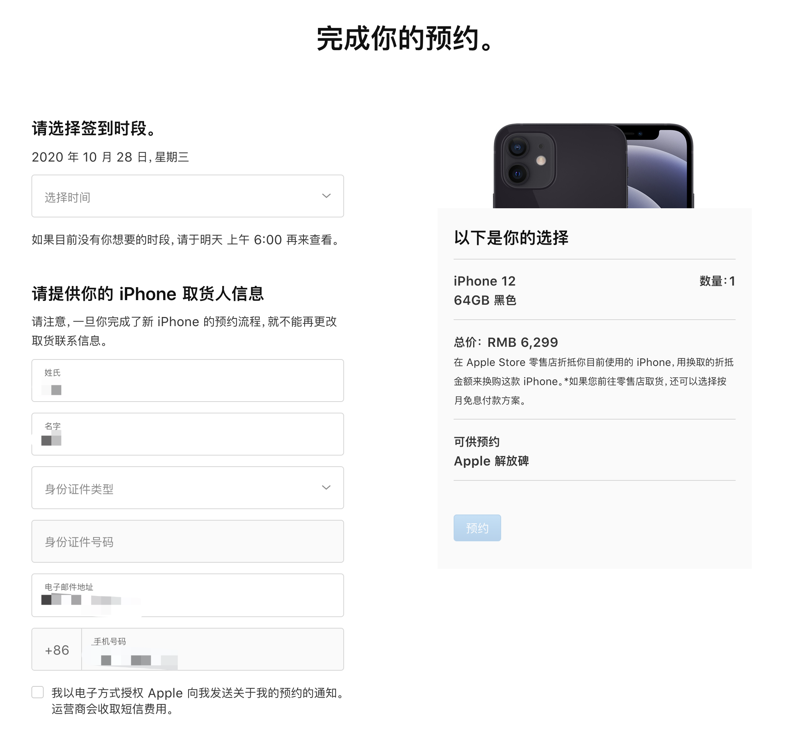

# Apple Store 预约助手
起因是想购买iPhone12Pro，又懒得一直守着官网，然后顺便学习 GUI框架 [fyne](https://github.com/fyne-io/fyne)

## 正常预约步骤
1. 进入商品预购页面
2. 选择具体型号和门店
3. 要求输入注册码
4. 选择到店时间，填写身份证号
5. 完成

## 重要提示
* *这不是外挂，不能全自动一劳永逸*
* *助手可以直接进入预约步骤3，快人2步，后续步骤需要自己手动操作*
* *提前登录*
* *提前获取注册码，30min内可以复用，获取方式是找个冷门型号走到获取注册码步骤*


## 关于开发
* 代码不优雅, 注释不完善, review须谨慎
* GUI框架 [fyne](https://github.com/fyne-io/fyne)

### 运行
```shell script
go run *.go
```

### 打包
```
# macos打包
go get fyne.io/fyne/cmd/fyne
fyne package -os darwin

# macos下打包其他平台
go get github.com/lucor/fyne-cross/cmd/fyne-cross
fyne-cross --targets=linux/amd64,windows/amd64 
```

## 使用方法

1. 前往 `release` 页面下载，启动
2. 首次运行点击 `测试` 按钮, 确保能正确打开浏览器
3. 选择门店和型号，点击 `添加` 到监控列表
4. 点击 `开始` 即可

匹配到之后会暂停监听，直到再次点击 `开始`

## 参考图片

效果预览


注册码获取页面


选择到店时间，填写身份证号

