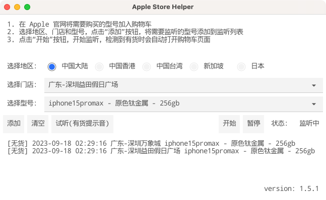

# Apple Store 预约助手

## 支持 iPhone 15 系列



## 重要提示
* *这不是外挂，不能全自动一劳永逸*
* *提前登录*
* *提前将需要购买的型号加入购物车，检测有货会打开购物车页面，需要在购物车页面手动选择门店*

## 关于开发
* 代码不优雅, 注释不完善, review须谨慎
* GUI框架 [fyne](https://github.com/fyne-io/fyne)

### 运行
```shell script
go run main.go
```

### 打包
```
# Mac OS 环境下打包
go install fyne.io/fyne/v2/cmd/fyne 
go install github.com/fyne-io/fyne-cross

fyne-cross darwin -arch=amd64,arm64 -app-id=apple.store.helper
fyne-cross windows -arch=amd64,386 -app-id=apple.store.helper
```

如果提示 `fyne-cross: command not found`，请配置 GO 环境变量  
添加以下内容到 `~/.zshrc` 或 `~/.bashrc` 中
```shell script
# GOLANG
export GOROOT=/usr/local/go
export GOPATH=$HOME/go
export PATH=$PATH:$GOPATH/bin
```
GOROOT 为 GO 安装目录，根据实际安装位置修改

## 使用方法

1. 前往 [release](https://github.com/hteen/apple-store-helper/releases) 页面下载对应系统的程序，启动 
2. 在 Apple 官网将需要购买的型号加入购物车
3. 选择地区、门店和型号，点击`添加`按钮，将需要监听的型号添加到监听列表
4. 点击`开始`按钮开始监听，检测到有货时会自动打开购物车页面
5. 匹配到有货后会自动暂停监听，直到再次点击 `开始`

### 有货时推送通知到 iOS 设备
1. App Store 下载并安装 App 「Bark」，并允许「Bark」进行推送
2. 打开「Bark」，复制应用中代表你自己设备的地址（格式如` https://api.day.app/xxxxxxxxx `），粘贴至本应用的`Bark 通知地址`栏
3. 点击 `测试 Bark 通知`，确认应用能够通知到你的 iOS 设备
4. 更多内容请参考 `https://bark.day.app/`

## Contributors
- [@Hteen](https://github.com/hteen)
- [@Timssse](https://github.com/Timssse)
- [@Black-Hole](https://github.com/BlackHole1)
- [@RayJason](https://github.com/RayJason)
- [@Warkeeper](https://github.com/Warkeeper)

## 一杯卡布奇诺 ☕️


